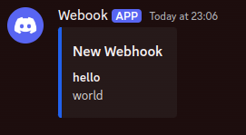
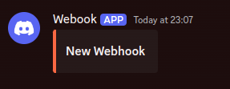
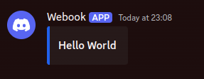

# webhook

A simple proxy that sends webhooks it recieves to Discord. It takes in a plain `Record<string, string | number | boolean>` like record to make sending simple.

## Send an embed

You can send your plain object (or an array of objects for multiple embeds), and it'll send it as an embed. All keys are stringified so you can't send nested objects.

```bash
curl -X POST -d '{"hello": "world"}' https://your-instance
```



## Special Fields

Keys that start wth `$` might have a special behaviour, and are all reserved for potential future use so won't show up in your embed.

### `$colour`

```bash
curl -X POST -d '{"$colour": "#f96743"}' https://your-instance
```



### `$title`

```bash
curl -X POST -d '{"$title": "Hello World"}' https://your-instance
```



## Hosting

This is designed to run on Cloudflare workers. To self-host it make sure you have [`pnpm`](https://pnpm.io/) and [`node`](https://nodejs.org/) installed, and then clone the repo.

1. Add your account to the [`wrangler.toml`](./wrangler.toml) file. You can find this in the URL of the Cloudflare dashboard.


2. Next you need to add your `HOOK_URL` secret you got from Discord, this can be done by running:

```bash
pnpm wrangler secret put HOOK_URL
```

3. Now you can deploy the worker:

```bash
pnpm run deploy
```

4. Finally, you can view the worker and add a custom domain on the [Cloudflare dashboard](https://dash.cloudflare.com?to=/:account/workers/services/view/webhook).
